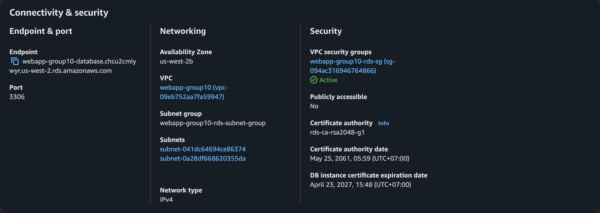
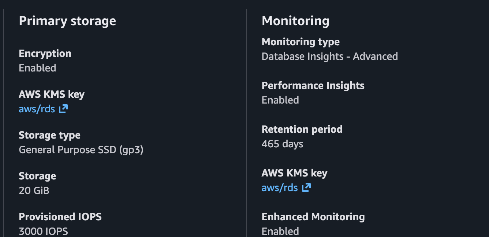
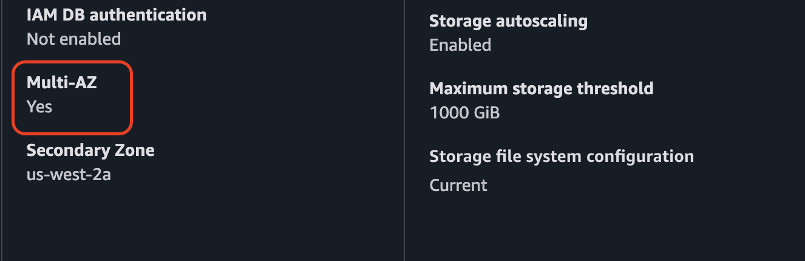
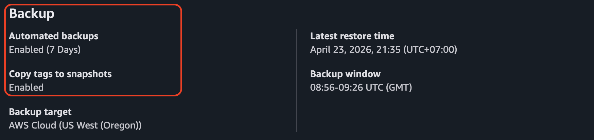
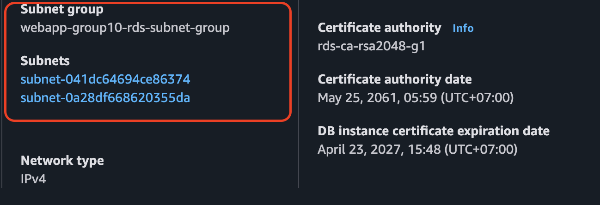
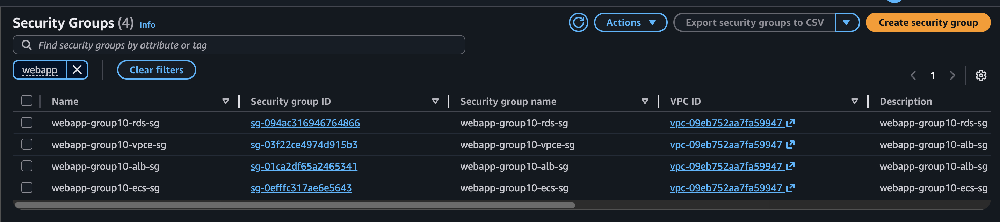
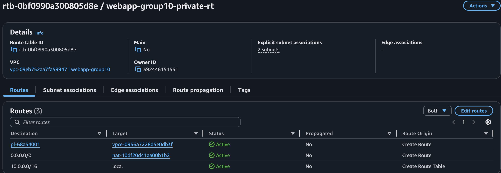
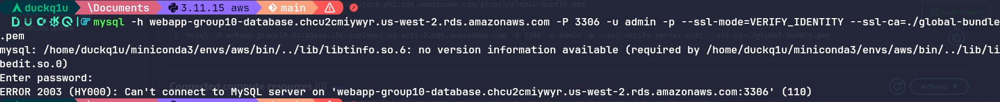
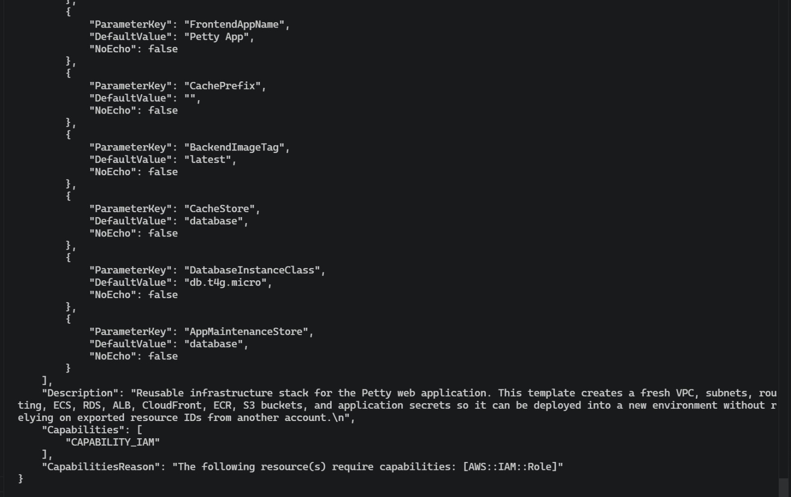
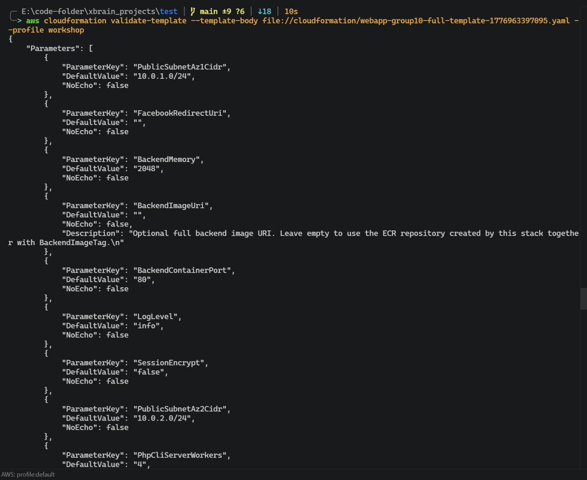

# W3 Evidence Pack — Petty VMCS

---

## Section 1 — Cover

| Field | Value |
|-------|-------|
| **Group** | Nhóm 10 |
| **Members** | Nguyễn Thị Mến, Lê Trần Tuấn Khanh, Phan Đức Huy, Huỳnh Xuân Hậu, Lê Văn Hải, Trần Mạnh Trường, Trần Quốc Hùng, Lê Viết Quốc Hưng, Trần Mạnh Cường, Nguyễn Đức Hảo |
| **App** | Petty VMCS — Hệ thống Quản lý Phòng khám Thú y |
| **Database path** | RDS MariaDB 11.8 / Relational |
| **W2 Evidence link** | _(paste link commit W2 evidence ở đây)_ |

---

## Section 2 — Data Access Pattern Log

### Part A — 3 Access Patterns thực tế của Petty VMCS

| # | Pattern | Tần suất ước tính |
|---|---------|-------------------|
| 1 | **Lấy danh sách lịch hẹn của một khách hàng**, lọc theo trạng thái (`pending`, `confirmed`...), sắp xếp theo `ngay_gio` | ~80 calls/min lúc peak (giờ mở cửa phòng khám) |
| 2 | **Đặt lịch hẹn mới** — insert vào `lich_hens` kèm FK đến `khach_hangs`, `thu_cungs`, `dich_vus`, `nhan_viens` trong một transaction | ~20 writes/min |
| 3 | **Tạo phiếu khám** (`phieu_khams`) sau khi bác sĩ hoàn thành khám — JOIN với `lich_hens` để lấy thông tin thú cưng + dịch vụ, đồng thời cập nhật `trang_thai` của `lich_hens` | ~15 writes/min |

---

### Part B — Engine + Paradigm + Cơ chế cho từng pattern

**Pattern 1 — Lấy lịch hẹn của khách hàng**

- **Engine:** RDS MariaDB 11.8 (managed relational)
- **Paradigm:** Relational
- **Cơ chế:** Query với `WHERE khach_hang_id = ? AND trang_thai = ?` trên bảng `lich_hens`. Index `lich_hens_trang_thai_index` trên cột `trang_thai` đã được định nghĩa trong schema. Kết quả JOIN với `thu_cungs` (FK `thu_cung_id`) và `dich_vus` (FK `dich_vu_id`) để trả về đầy đủ thông tin cho frontend.

```sql
SELECT lh.*, tc.ten_thu_cung, dv.ten AS ten_dich_vu
FROM lich_hens lh
JOIN thu_cungs tc ON lh.thu_cung_id = tc.id
LEFT JOIN dich_vus dv ON lh.dich_vu_id = dv.id
WHERE lh.khach_hang_id = 42
  AND lh.trang_thai = 'pending'
ORDER BY lh.ngay_gio ASC;
```

**Pattern 2 — Đặt lịch hẹn mới (transaction)**

- **Engine:** RDS MariaDB 11.8
- **Paradigm:** Relational — ACID transaction
- **Cơ chế:** Laravel Eloquent bọc toàn bộ trong `DB::transaction()`. Đảm bảo nếu bất kỳ bước nào fail (ví dụ: `dich_vu_id` không tồn tại), toàn bộ rollback. FK constraints (`lich_hens_khach_hang_id_foreign`, `lich_hens_thu_cung_id_foreign`, `lich_hens_dich_vu_id_foreign`) được enforce ở tầng DB.

**Pattern 3 — Tạo phiếu khám + cập nhật lịch hẹn**

- **Engine:** RDS MariaDB 11.4
- **Paradigm:** Relational — multi-table write + JOIN
- **Cơ chế:** INSERT vào `phieu_khams` với FK `lich_hen_id`, đồng thời UPDATE `lich_hens.trang_thai = 'hoan_thanh'` và set `thoi_gian_hoan_thanh`. Hai thao tác này trong cùng một transaction để đảm bảo consistency.

---

### Part C — Wrong-Paradigm Test

**Pattern được chọn:** Pattern 2 — Đặt lịch hẹn mới

**Nếu dùng DynamoDB (key-value) thay vì RDS:**

Khi đặt lịch hẹn, hệ thống cần đảm bảo `khach_hang_id`, `thu_cung_id`, `dich_vu_id`, `nhan_vien_id` đều tồn tại và hợp lệ — đây là referential integrity mà DynamoDB không enforce ở tầng DB. Để thay thế, code phải tự validate từng FK bằng N lần `GetItem` riêng lẻ trước khi write, và nếu một trong các bước fail thì phải tự rollback bằng `TransactWriteItems` với tối đa 25 items — phức tạp hơn nhiều so với một SQL transaction. Ngoài ra, query "lấy tất cả lịch hẹn của khách hàng X, sắp xếp theo ngày" trên DynamoDB đòi hỏi GSI với PK=`khach_hang_id` + SK=`ngay_gio`, nhưng nếu một khách hàng có hàng trăm lịch hẹn thì hot partition sẽ xảy ra — đây là anti-pattern của DynamoDB.

---

## Section 3 — Deployment Evidence


---

### 3.1 RDS Instance — Private Subnet



> **Notes:** RDS được đặt trong private subnet (`webapp-group10-database-subnet-2a`, `webapp-group10-database-subnet-2b`) — không có public IP, không thể truy cập từ internet. Chỉ ECS Security Group mới được phép kết nối vào port 3306. Đây là yêu cầu bắt buộc cho database tier trong 3-tier architecture.

---

### 3.2 RDS Instance — Encryption at Rest



> **Notes:** Encryption at rest được bật với AWS-managed KMS key (`aws/rds`). Chọn AWS-managed thay vì customer CMK vì không có compliance mandate yêu cầu key rotation tự quản lý — AWS tự động rotate key hàng năm, giảm operational overhead.

---

### 3.3 RDS Instance — Multi-AZ



> **Notes:** Multi-AZ enabled với synchronous standby ở AZ2. Standby không nhận read traffic — mục đích duy nhất là automatic failover khi Primary AZ có sự cố. RTO (Recovery Time Objective) với Multi-AZ là ~60-120 giây, phù hợp với SLA của phòng khám.

---

### 3.4 RDS Instance — Automated Backups



> **Notes:** Automated backup 7 ngày cho phép Point-in-Time Recovery (PITR) về bất kỳ thời điểm nào trong 7 ngày qua. Backup window được set vào giờ thấp điểm (ví dụ: 02:00-03:00 UTC+7) để tránh ảnh hưởng performance.

---

### 3.5 DB Subnet Group — 2 AZ



> **Notes:** DB Subnet Group span 2 AZ là điều kiện bắt buộc để enable Multi-AZ. AWS cần ít nhất 2 AZ để đặt Primary và Standby instance.

---

### 3.6 Security Group — DB SG inbound từ App-tier SG




> **Notes:** DB Security Group chỉ cho phép inbound port 3306 từ ECS Security Group ID — không dùng CIDR (`10.0.0.0/16`) vì CIDR quá rộng, bất kỳ resource nào trong VPC đều có thể kết nối. Dùng SG reference đảm bảo chỉ ECS task mới vào được DB.

---

### 3.7 Lambda Function — Execution Role (no wildcard)


> **Notes:** Lambda execution role được scope về specific actions và specific resource ARNs theo principle of least privilege.

---

### 3.8 Lambda Function — Trigger hoạt động


> **Notes:** Trigger đang dùng là API Gateway endpoint. API Gateway nhận request từ client qua HTTPS POST, sau đó kích hoạt Lambda Function để xử lý logic backend, ví dụ kiểm tra API key, gọi Bedrock Agent và trả response về cho client.

---

### 3.9 Bedrock Knowledge Base — Sync Complete


> **Notes:** Knowledge Base kết nối với S3 bucket từ W2. Embedding model: _(điền tên — ví dụ: Amazon Titan Embeddings G1 - Text)_. Vector store: _(điền — ví dụ: OpenSearch Serverless)_. Chunking strategy: default (300 tokens, 20% overlap).

---

### 3.10 VPC — S3 Gateway Endpoint trong Route Table



> **Notes:** S3 Gateway Endpoint được thêm vào route table của private subnet để ECS task gọi S3 (kéo .env file, upload ảnh) không đi qua NAT Gateway. Điều này giảm chi phí NAT (~$0.045/GB) và tăng security vì traffic không ra internet.

---

## Section 4 — Working Query Evidence

> Paradigm: **Relational** → cần 1 JOIN query + 1 indexed lookup

---

### 4.1 JOIN Query — Lịch hẹn + Thú cưng + Dịch vụ


```sql
-- Pattern 1: Lấy lịch hẹn của khách hàng kèm thông tin thú cưng và dịch vụ
MariaDB [laravel]> SELECT
    ->     lh.id,
    ->     lh.ngay_gio,
    ->     lh.trang_thai,
    ->     dv.ten AS ten_dich_vu,
    ->     dv.gia_tien
    -> FROM lich_hens lh
    -> JOIN dich_vus dv
    ->     ON lh.dich_vu_id = dv.id
    -> WHERE lh.trang_thai = 'pending'
    -> ORDER BY lh.ngay_gio ASC;
+----+---------------------+------------+--------------+-----------+
| id | ngay_gio            | trang_thai | ten_dich_vu  | gia_tien  |
+----+---------------------+------------+--------------+-----------+
|  2 | 2026-03-27 11:00:00 | pending    | Cắt tỉa lông | 150000.00 |
|  3 | 2026-04-02 13:30:00 | pending    | Cắt tỉa lông | 150000.00 |
|  4 | 2026-04-24 11:00:00 | pending    | Cắt tỉa lông | 150000.00 |
+----+---------------------+------------+--------------+-----------+
3 rows in set (0.001 sec)
```

> **Notes:** Query này JOIN 4 bảng (`lich_hens`, `khach_hangs`, `thu_cungs`, `dich_vus`) thông qua FK relationships được định nghĩa trong schema. Đây là access pattern cốt lõi của hệ thống — staff cần xem đầy đủ thông tin lịch hẹn trong một query thay vì N+1 requests. Relational paradigm phù hợp vì data có FK relationships rõ ràng.

---

### 4.2 Indexed Lookup — Tìm lịch hẹn theo trạng thái


```sql
-- Indexed lookup: dùng index lich_hens_trang_thai_index
EXPLAIN SELECT * FROM lich_hens WHERE trang_thai = 'pending';
```

Cần thấy trong kết quả EXPLAIN: cột `key` = `lich_hens_trang_thai_index` (không phải NULL), `type` không phải `ALL` (full scan)

> **Notes:** Index `lich_hens_trang_thai_index` trên cột `trang_thai` được định nghĩa trong schema.sql. EXPLAIN confirm index được sử dụng thay vì full table scan — quan trọng khi bảng `lich_hens` có nhiều records theo thời gian.

---

## Section 5 — Lambda + Bedrock Evidence

---

### 5.1 CloudWatch Logs — Lambda được trigger


> **Notes:** Log stream này được tạo sau khi trigger Lambda bằng _(S3 upload / API Gateway call — điền cụ thể)_. Timestamp trong log confirm function đã thực sự chạy, không chỉ deployed.

---

### 5.2 Bedrock API Response — từ Lambda hoặc CLI


```bash
curl -X POST "https://8ibkjuuj8h.execute-api.us-west-2.amazonaws.com/prod/" ^
-H "Content-Type: application/json" ^
-H "apikey: hahahahuhuhuhehehe" ^
-d "{\"question\":\"Bạn là ai ?\"}"
```

Hoặc chụp CloudWatch log của Lambda function khi nó gọi Bedrock và trả về response.

> **Notes:** Đây là real API call từ CLI/Lambda — không phải Bedrock Playground. Response chứa `output.text` là câu trả lời được synthesize từ documents trong Knowledge Base, và `citations` chỉ ra document nào được dùng.

---

## Section 6 — VPC + Networking Evidence

---

### 6.1 Route Table — S3 Gateway Endpoint


> **Notes:** Route table của private subnet có entry `pl-xxxxxxxx (S3) → vpce-xxxxxxxx`. Traffic từ ECS đến S3 đi qua AWS backbone, không qua NAT Gateway — giảm chi phí và tăng security.

---

### 6.2 DB Security Group — Inbound từ App-tier SG


> **Notes:** Inbound rule port 3306 source là ECS Security Group ID (`sg-xxxxxxxx`), không phải CIDR. Chỉ ECS task mới kết nối được vào DB.

---

## Section 7 — Negative Security Test



> **Notes:** Chạy lệnh `mysql -h [RDS_ENDPOINT] -u petty -p --connect-timeout=10` từ máy local để thử kết nối trực tiếp vào RDS — kết quả bị `ERROR 2003 (HY000): Can't connect to MySQL server` hoặc connection timeout. Lý do: RDS không có public IP, DB Security Group không có inbound rule từ `0.0.0.0/0`. Defense-in-depth: ngay cả khi biết endpoint, không thể kết nối từ ngoài VPC.

---

## Section 8 — Bonus (Optional)

### 8.1 CloudFormation Partial Template





> **Notes:** Chạy `aws cloudformation validate-template --template-body file://cfn-partial.yaml` — output không có error, confirm template syntactically valid. Template provisioning ít nhất 1 W3 resource (RDS / Lambda / VPC).
